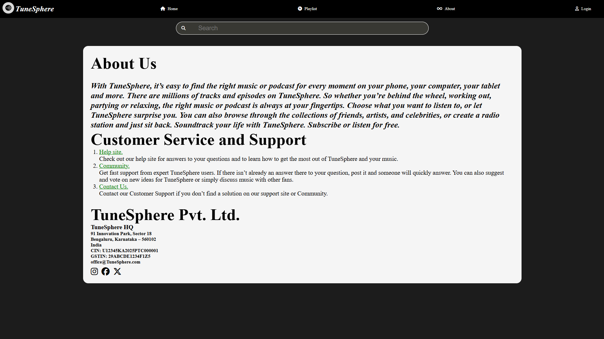
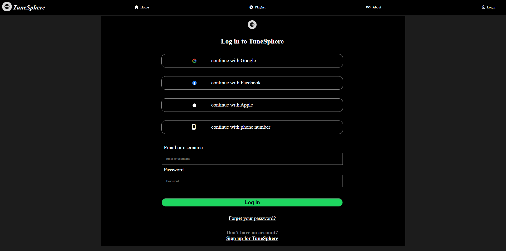

# TuneSphere Music Player 🎵

[Live Demo](https://atif-nawab.github.io/TuneSphere_music_player/)

---

## Table of Contents
- [Overview](#overview)
- [Features](#features)
- [Screenshots](#screenshots)
- [Technologies Used](#technologies-used)
- [Installation](#installation)
- [Usage](#usage)
- [Folder Structure](#folder-structure)
- [License](#license)

---

## Overview
TuneSphere is a modern offline music player web application designed to provide a seamless music experience. It allows users to play, pause, navigate through songs, create playlists, and enjoy high-quality audio all in a user-friendly interface. The website is responsive and works well on both desktop and mobile devices.

---

## Features
- Play, pause, forward, and backward music controls
- Playlist display with cover images and song titles
- Dynamic progress bar and time display for each track
- Interactive mini-player icons for each song
- Search bar to filter songs
- Responsive navigation bar with sidebar for mobile screens
- Home, Playlist, About, and Login sections
- Footer audio player with animated GIF indicator for the currently playing song
- High-quality audio and seamless offline experience

---

## Screenshots





*(Replace the above screenshots with actual images from your project folder)*

---

## Technologies Used
- **HTML5** – for structuring the web pages  
- **CSS3** – for styling, animations, and responsive layouts  
- **JavaScript** – for audio control, dynamic playlist, and interactions  
- **Font Awesome** – for icons  
- **GitHub Pages** – for hosting the live demo  

---

## Installation
1. Clone the repository:
   ```bash
   git clone https://github.com/atif-nawab/TuneSphere_music_player.git
